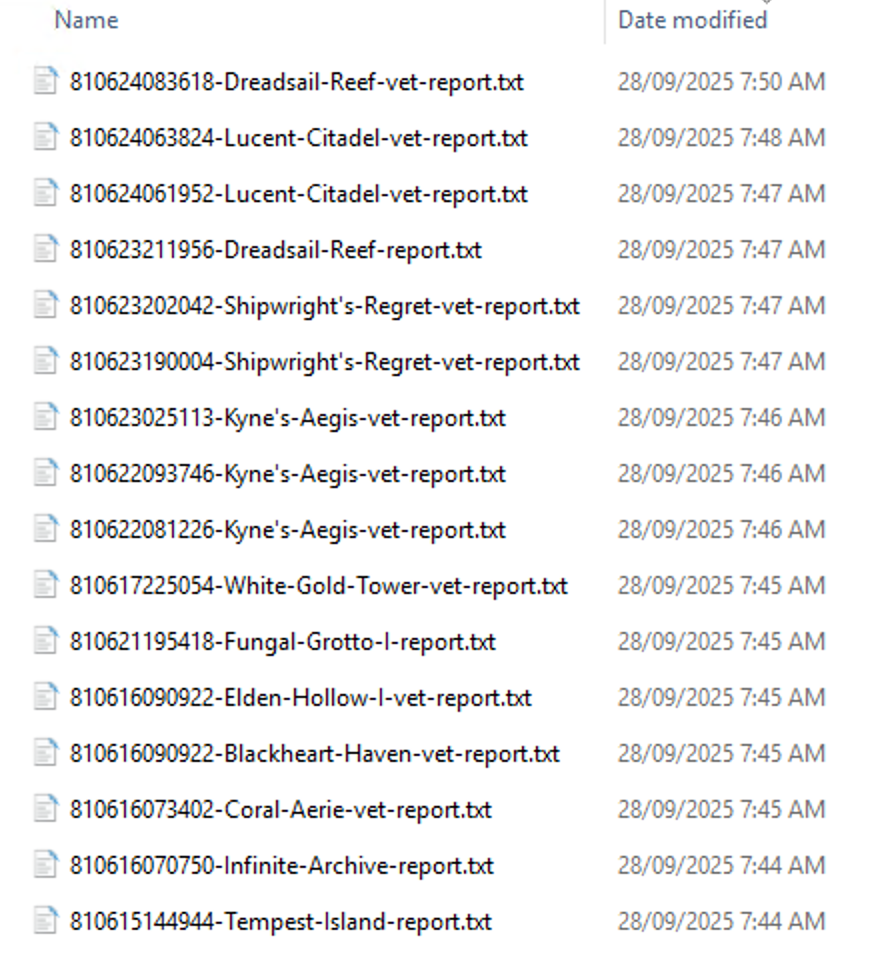

# ESO Live Encounter Log Sets & Abilities Analyzer: ESO Log Tail


ESO Log Tail: Live monitoring of Elder Scrolls Online encounter logs to show you how your group is built. ESO Log Tail uses `/encounterlog` to print summaries of encounters as soon as each combat ends.

- Encounter Summary
- Whether some critical buffs were present in a group
- Subclass build inference
- Sorts players by their DPS
- Highlights missing 5pc bonuses
- Who has a taunt?
- Opinionated about how much health you should have

## Example Output


*Example output showing a comprehensive combat encounter analysis with 12 players, including detailed player information, abilities, gear sets, DPS contributions, and group buff tracking.*

## Command Line Options

```bash
Usage: esolog_tail.py [OPTIONS]

  ESO Encounter Log Analyzer - Monitor and analyze ESO combat encounters.

Options:
  -f, --log-file PATH         Path to ESO encounter log file
  -s, --read-all-then-stop    Read mode: replay the entire log file from the
                              beginning at high speed, then exit
  -t, --read-all-then-tail    Read the entire log file from the beginning,
                              then continue tailing for new data
  --no-wait                   Exit immediately if log file does not exist
                              (default: wait for file to appear)
  -r, --replay-speed INTEGER  Replay speed multiplier for read mode (default:
                              100x)
  -v, --version               Show version information and exit
  --list-hostiles             Testing mode: List all hostile monsters added to
                              fights with names and IDs
  --diagnostic                Diagnostic mode: Show detailed timing and data
                              flow information for debugging
  --tail-and-split            Auto-split mode: Automatically create individual
                              encounter files while tailing the main log
  --split-dir PATH            Directory for split files (default: same
                              directory as source log file)
  --save-reports              Save encounter reports to files with timestamp-
                              based naming
  --reports-dir PATH          Directory for saved reports (default: same
                              directory as source log file)
  --help                      Show this message and exit.
```


## Example Setup 

- Download and extract esolog-tail.exe to somewhere convenient like an esolog-tail directory on your desktop or documents folder. 
- Open the esolog-tail.exe and select the option to "run anyway" if windows doesn't know the provenance of the application.
- Create a ESOLOG-TAIL.BAT file that looks a bit like this (but modify your BAT file to select the options and locations you prefer)

```
"C:\Users\Nebula PC\OneDrive\Documents\eso-analyzer-windows-installer\installer\esolog-tail.exe" --read-all-then-tail ^
--tail-and-split --split-dir "d:\esologs\splits" ^
--save-reports --reports-dir "d:\esologs\reports" ^
-f "C:\Users\Nebula PC\OneDrive\Documents\Elder Scrolls Online\live\Logs\Encounter.log"
``` 

Then when you click on the ESOLOG-TAIL.BAT file, you will see the tool creating fight reports before waiting on more log output. 



While this is happening, the `--tail-and-split` and `--save-reports` options will create split logs and report files for the encounters in the log, and that appear in the Encounter.log as you play. 


### Default Behavior

When no command-line arguments are provided, the tool will:
- **Auto-detect** ESO log file location based on your operating system
- **Wait patiently** for Encounter.log to appear (if not found)
- **Read existing** log data, then monitor for new encounters in real-time
- **Generate live** combat analysis reports as fights happen

Use `--help` to see all available options.


## Installation

### Option 1: Standalone Installers (Recommended)

Download the latest release for your platform:
- **Windows**: `esolog-tail-windows-installer.zip`
- **macOS**: `esolog-tail-macos-installer.zip`
- **Linux**: `esolog-tail-linux-installer.tar.gz`

### Option 2: Manual Installation

1. **Clone the repository:**
   ```bash
   git clone https://github.com/brainsnorkel/eso-live-encounterlog-sets-abilities.git
   cd eso-live-encounterlog-sets-abilities
   ```

2. **Install Python dependencies:**
   ```bash
   pip install -r requirements.txt
   ```

3. **Make the script executable (macOS/Linux):**
   ```bash
   chmod +x src/esolog_tail.py
   ```

### Enable ESO Encounter Logging

**Important**: ESO encounter logging must be enabled in-game for this tool to work.

#### Automatic Logging (Recommended)
Install the **[Easy Stalking - Encounterlog](https://www.esoui.com/downloads/info2332-EasyStalking-Encounterlog.html)** addon to automatically start/stop encounter logging based on content type:
- Automatically logs in Dungeons, Trials, Arenas, Battlegrounds, etc.
- Visual on-screen indicator when logging is active
- Configurable for different content types
- `/ezlog` chat command for manual control

#### Manual Logging
Alternatively, you can manually enable encounter logging:
- In-game: `/encounterlog` (toggles logging on/off)
- Or enable in Settings → Combat → Combat Logging

## Usage

### Live Monitoring

**Auto-detect ESO log file (Recommended):**
```bash
python3 src/esolog_tail.py
```
The tool automatically detects the most likely ESO log directory based on your operating system:
- **Windows**: `%USERPROFILE%\Documents\Elder Scrolls Online\live\Logs\`
- **macOS**: `~/Documents/Elder Scrolls Online/live/Logs/` or Wine location
- **Linux**: `~/.wine/drive_c/users/Public/Documents/Elder Scrolls Online/live/Logs/`

**Specify log file manually:**
```bash
python3 src/esolog_tail.py --log-file "/path/to/ESO/Logs/Encounter.log"
```

### Test Mode

**Replay sample log file:**
```bash
python3 src/esolog_tail.py --scan-all-then-stop
```

**Replay at different speeds:**
```bash
python3 src/esolog_tail.py --scan-all-then-stop --replay-speed 1000  # 1000x speed
```

### Advanced Monitoring Options

**Exit immediately if log file doesn't exist:**
```bash
python3 src/esolog_tail.py --no-wait
```
By default, the tool will wait for the Encounter.log file to be created and print status updates every minute.

**Read entire log history then tail:**
```bash
python3 src/esolog_tail.py --read-all-then-tail
```
This reads the entire existing log file from the beginning, then continues monitoring for new data.

**Check version:**
```bash
python3 src/esolog_tail.py --version
# or
python3 src/esolog_tail.py -v
```

**Combine options:**
```bash
python3 src/esolog_tail.py --log-file /custom/path/Encounter.log --read-all-then-tail
```

### Report Saving

**Save encounter reports to files:**
```bash
python3 src/esolog_tail.py --save-reports
```
This automatically saves each encounter report to a timestamped file in the same directory as the log file.

**Specify custom reports directory:**
```bash
python3 src/esolog_tail.py --save-reports --reports-dir /path/to/reports
```

**Report file naming:**
Reports are saved with zone-based naming similar to split files: `YYMMDDHHMMSS-{Zone-Name with dashes}{-vet or blank}-report.txt` where the timestamp corresponds to the encounter start time. For example:
- `250125143022-Tempest-Island-report.txt` (Normal mode encounter)
- `250125143022-Coral-Aerie-vet-report.txt` (Veteran mode encounter)
- `250125143022-Unknown-Zone-report.txt` (When zone information is unavailable)

**Directory requirements:**
- The reports directory must exist and be writable
- If the directory doesn't exist, the tool will attempt to create it
- If creation fails due to permissions, the tool will exit with clear error messages
- You can create the directory manually: `mkdir -p /path/to/reports`

**Combined with other features:**
```bash
python3 src/esolog_tail.py --save-reports --reports-dir ./reports --tail-and-split --split-dir ./splits
```

### Auto-Split Logs

**Automatically create individual encounter files:**
```bash
python3 src/esolog_tail.py --tail-and-split
```
This creates individual log files for each encounter while tailing the main log.

**Specify custom split directory:**
```bash
python3 src/esolog_tail.py --tail-and-split --split-dir /path/to/splits
```

**Split file naming:**
Split files are named with the format `YYMMDDHHMMSS-{Zone-Name}{-vet}.log` where:
- `YYMMDDHHMMSS` is the timestamp when the encounter started
- `{Zone-Name}` is the name of the first zone encountered during combat (with spaces converted to dashes)
- `{-vet}` is added for veteran difficulty encounters

**Combat-based zone detection:**
The tool creates a temporary file immediately when logging starts, then waits for combat to begin (`BEGIN_COMBAT` event) and uses the first `ZONE_CHANGED` event that occurs during combat to rename the file. This ensures the file is named after the actual combat zone rather than just the initial zone when logging started, while preventing any data loss through immediate file creation.

**Combined with other modes:**
```bash
python3 src/esolog_tail.py --read-all-then-stop --tail-and-split --split-dir ./encounters
```

## Troubleshooting

**No encounter reports generated:**
If you're not seeing encounter reports, ensure your log file contains complete encounters with `BEGIN_COMBAT` and `END_COMBAT` events. The tool requires these markers to detect and process encounters properly.

**Diagnostic mode:**
Use `--diagnostic` to see detailed information about event processing:
```bash
python3 src/esolog_tail.py --diagnostic --log-file your_log.log
```

### Real-World Usage Examples

**Start monitoring with default behavior (waits for log file):**
```bash
python3 src/esolog_tail.py
```

**Read existing log history then continue tailing:**
```bash
python3 src/esolog_tail.py --read-all-then-tail
```

**Quick version check:**
```bash
python3 src/esolog_tail.py -v
```

**Exit immediately if log file doesn't exist:**
```bash
python3 src/esolog_tail.py --no-wait
```

## Advanced Command Line Options

### Core Options
- `--log-file`, `-f`: Path to ESO encounter log file
- `--read-all-then-stop`, `-s`: Read mode: replay the entire log file from the beginning at high speed, then exit
- `--read-all-then-tail`, `-t`: Read the entire log file from the beginning, then continue tailing for new data
- `--no-wait`: Exit immediately if log file does not exist (default: wait for file to appear)
- `--replay-speed`, `-r`: Replay speed multiplier for read mode (default: 100x)
- `--version`, `-v`: Show version information and exit

### Analysis Options
- `--list-hostiles`: Testing mode: List all hostile monsters added to fights with names and IDs
- `--diagnostic`: Diagnostic mode: Show detailed timing and data flow information for debugging

### File Management Options
- `--tail-and-split`: Auto-split mode: Automatically create individual encounter files while tailing the main log
- `--split-dir PATH`: Directory for split files (default: same directory as source log file)
- `--save-reports`: Save encounter reports to files with timestamp-based naming
- `--reports-dir PATH`: Directory for saved reports (default: same directory as source log file)

## ESO Log File Locations

The tool automatically searches for ESO encounter logs in common locations:

**Windows:**
- `%USERPROFILE%\Documents\Elder Scrolls Online\live\Logs\Encounter.log`
- `%USERPROFILE%\Documents\Elder Scrolls Online\Logs\Encounter.log`
- `%USERPROFILE%\OneDrive\Documents\Elder Scrolls Online\live\Logs\Encounter.log`

**macOS (via Wine):**
- `~/Documents/Elder Scrolls Online/live/Logs/Encounter.log`
- `~/.wine/drive_c/users/Public/Documents/Elder Scrolls Online/live/Logs/Encounter.log`

**Enhanced Detection:**
The tool automatically searches all available locations and selects the most recently updated `Encounter.log` file. If multiple directories are found, it will report all locations and their last modified dates to help you understand which file is being used.

## Output Format

When a combat encounter ends, the tool displays:

```
=== ZONE CHANGED ===
Zone: Lucent Citadel (VETERAN)
2025-09-14 09:58:25 (Lucent Citadel) | 19s | GrpDPS: 361,331 | Darkcaster Slasher (HP: 3,881,030)
MCourage: 43.0% MForce: 0.0% Mslayer: 0.0% PA: 0.0% LE: 0.0% PW: 0.0%

@brainsnorkel Ok Beamer Herald/Aedric/Ardent (Arcanist M:16.5k S:28.5k H:20.5k D:20.1%)
  Cephaliarch's Flail, Pragmatic Fatecarver, Quick Cloak, Barbed Trap, Camouflaged Hunter, Everlasting Sweep
  Blockade of Fire, Flames of Oblivion, Engulfing Flames, Inspired Scholarship, Pestilent Trample, Standard of Might
  5xpAnsuul's Torment, 2pc Perfected Crushing Wall, 1pc Slimecraw, 5xpSul-Xan's Torment, Velothi Ur-Mage's Amulet

@Evil-Dave Whatchu talkin bout Rilis Herald/Ass/Daedric (Arcanist M:17.5k S:35k H:19.5k D:17.1%)
  Cephaliarch's Flail, Pragmatic Fatecarver, Daedric Prey, Summon Volatile Familiar, Summon Twilight Matriarch, Incapacitating Strike
  Quick Cloak, Inspired Scholarship, Relentless Focus, Summon Volatile Familiar, Summon Twilight Matriarch, Summon Charged Atronach
  1pc Slimecraw, 5xpSlivers of the Null Arca, 2pc Spectral Cloak, 5pc Unleashed Ritualist, Velothi Ur-Mage's Amulet

@SevenStrings Seventh Column Aedric/Ardent/Ass (Templar M:14k S:32k H:21k D:16.2%)
  Biting Jabs, Barbed Trap, Merciless Resolve, Killer's Blade, Shocking Banner, Incapacitating Strike
  Stampede, Flames of Oblivion, Venomous Claw, Molten Whip, Shocking Banner, Standard of Might
  2pc Perfected Merciless Charge, 2pc Selene, 5pc Tide-Born Wildstalker, 3pc Perfected Whorl of the Depths, 2pc Whorl of the Depths

@boilingcrab Skrimp Tahco Herald/Ass/Dawn (Arcanist M:15.5k S:31.5k H:27k D:14.8%)
  Cephaliarch's Flail, Pragmatic Fatecarver, Quick Cloak, Radiant Glory, Camouflaged Hunter, Soul Harvest
  Elemental Blockade, Fulminating Rune, Solar Barrage, Inspired Scholarship, Camouflaged Hunter, The Languid Eye
  5pc Ansuul's Torment, 2pc Perfected Crushing Wall, 5pc Deadly Strike, Velothi Ur-Mage's Amulet, 1pc Zaan

@GlitterGirl25 princessplar Aedric/Ass/Grave (Templar M:14k S:32k H:21k D:12.5%)
  Blighted Blastbones, Biting Jabs, Detonating Siphon, Merciless Resolve, Shocking Banner, Soul Harvest
  Stampede, Skeletal Archer, Barbed Trap, Resolving Vigor, Shocking Banner, Ice Comet
  5pc Aegis Caller, 2pc Perfected Merciless Charge, 5pc Perfect Arms of Relequen, 2pc Selene

@Rowan_Rainbow Rowan Uncia mac Deuce Ass/Aedric/Storm (Nightblade M:15k S:30k H:25k D:9.3%)
  Quick Cloak, Relentless Focus, Camouflaged Hunter, Necrotic Orb, Biting Jabs, Flawless Dawnbreaker
  Hurricane, Camouflaged Hunter, Lightning Flood, Blazing Spear, Endless Hail, Incapacitating Strike
  5pc Deadly Strike, 2pc Orpheon the Tactician, 5pc Slivers of the Null Arca, 2pc Thunderous Volley

@FizzyElfs Fizzyelves Ardent/Aedric/Ass (Dragonknight M:32k S:17k H:29k D:7.0%)
  Molten Whip, Flames of Oblivion, Engulfing Flames, Blazing Spear, Relentless Focus, Standard of Might
  Biting Jabs, Aurora Javelin, Explosive Charge, Blazing Spear, Sun Shield, Everlasting Sweep
  5pc Deadly Strike, Oakensoul Ring, 7pc Sergeant's Mail, 1pc Slimecraw

@Scedos Ráynor Earthen/Soldier/Winter (Dragonknight M:19k S:20k H:46.5k D:0.9%)
  Revealing Flare, Polar Wind, Impervious Runeward, Leashing Soul, Runic Sunder, Reviving Barrier
  Expansive Frost Cloak, Runeguard of Freedom, Elemental Blockade, Elemental Susceptibility, Igneous Weapons, Gibbering Shelter
  5pc Lucent Echoes, 2pc Nazaray, 7pc Xoryn's Masterpiece

@Viburnum Viburnum Opulus Draconic/Grave/Soldier (Dragonknight M:19.5k S:19k H:46.5k D:0.9%)
  Coagulating Blood, Impervious Runeward, Runic Sunder, Runeguard of Still Waters, Warding Contingency, Glacial Colossus
  Razor Caltrops, Elemental Blockade, Leashing Soul, Hardened Armor, Overflowing Altar, Aggressive Horn
  1pc Armor of the Trainee, 1pc Druid's Braid, 5pc Pearlescent Ward, 5pc Powerful Assault, 2pc Tremorscale

@Zinneth Mara Middlewind Green/Restoring/Shadow (Warden M:37.5k S:15k H:28.5k D:0.7%)
  Combat Prayer, Radiating Regeneration, Illustrious Healing, Budding Seeds, Extended Ritual, Replenishing Barrier
  Elemental Blockade, Echoing Vigor, Elemental Susceptibility, Refreshing Path, Energy Orb, Aggressive Horn
  2pc Grand Rejuvenation, 5pc Jorvuld's Guidance, 2pc Ozezan the Inferno, 5pc Roaring Opportunist

@Flame.song Ravellen Siphoning (Templar M:37.5k S:17k H:24k D:0.5%)
  Charging Maneuver, Funnel Health, Energy Orb, Overflowing Altar, Siphoning Attacks, Aggressive Horn
  Echoing Vigor, Illustrious Healing, Healthy Offering, Warding Burst, Radiating Regeneration, Soul Siphon
  2pc Ozezan the Inferno, 7pc Pillager's Profit, 5pc Spell Power Cure

=== Hostile Monsters Engaged by Players ===
  Darkcaster Slasher (ID: 117, Type: MONSTER, HP: 3,881,030, Damage: 2,930,572)
  Darkcaster Skirmisher (ID: 115, Type: MONSTER, HP: 3,881,030, Damage: 2,905,353)
  Dremora Battlemage (ID: 113, Type: MONSTER, HP: 431,227, Damage: 325,530)
  Dremora Lurker (ID: 114, Type: MONSTER, HP: 431,227, Damage: 281,911)
  Dremora Lurker (ID: 118, Type: MONSTER, HP: 431,227, Damage: 267,285)
  Dremora Battlemage (ID: 116, Type: MONSTER, HP: 431,227, Damage: 172,707)
Total hostile monsters engaged: 6
```

### Output Components

- **Timestamp**: Accurate local date/time when combat started (using Unix timestamps from log data)
- **Zone & Duration**: Combat location and duration in seconds
- **Player Count & DPS**: Number of players and estimated group DPS
- **Target**: Primary enemy that received the most damage events with health pool (HP: X,XXX)
- **Group Buffs**: Visual indicators (✅/❌) for critical group buffs (Major Courage, Major Force, Major Slayer)
- **Player Info**: Character name, skill lines, class, and resource values (M:X.Xk S:X.Xk H:X.Xk D:X.X%)
- **Resource Values**: Maximum health, magicka, stamina with color coding for anomalies (red for unusual health values)
- **Resource Highlighting**: Bold and underlined highest max resource type for each player
- **DPS Percentage**: Each player's damage contribution as percentage of total group damage (D:X.X%)
- **Ability Bars**: Combined front bar and back bar equipped abilities with purple highlighting for taunt abilities
- **Taunt Detection**: Purple highlighting for 35+ taunt abilities across all classes and weapon lines
- **Equipment**: Gear sets with piece counts and accurate set names from LibSets database
- **Build Analysis**: Inferred class and skill line combinations for build identification
- **Hostile Monsters**: Detailed list of enemies engaged by players with damage amounts and health pools

## Analysis Features

### Skill Line Detection

The tool analyzes equipped abilities to determine skill lines using UESP as the authoritative source:
- **Class Skill Lines**: Herald of the Tome, Assassination, Winter's Embrace, etc.
- **Weapon Skill Lines**: Destruction Staff, Restoration Staff, Two Handed, etc.
- **Guild Skill Lines**: Fighters Guild, Mages Guild, Undaunted, etc.

### Gear Set Identification

The tool identifies gear sets by:
- **Set ID Mapping**: Uses LibSets database to map set IDs to set names
- **Comprehensive Database**: Includes 704 gear sets from LibSets
- **Accurate Detection**: Shows actual equipped gear pieces with set names

### Buff Detection & Analysis

- **Group Buff Monitoring**: Tracks critical group buffs (MCourage, MForce, Mslayer, PA, LE, PW)
- **Clean Display**: Shows buff uptime percentages without visual clutter
- **Individual Uptime**: Calculates buff uptime percentage for each player
- **Buff Tracking**: Monitors buff applications and removals throughout encounters
- **New Buffs**: Added Lucent Echoes (LE) and Pearlescent Ward (PW) tracking

### Damage & Resource Analysis

- **Damage Percentages**: Shows each player's contribution to total damage
- **Player Sorting**: Displays players in descending order by damage contribution
- **Resource Tracking**: Monitors maximum health, magicka, and stamina values for each player
- **Health Anomaly Detection**: Highlights unusual health values (below 18.5k or above 44.5k) in red
- **DPS Calculation**: Estimates group DPS (GrpDPS) based on total damage and combat duration
- **Duration Format**: Displays fight durations in minutes:seconds format, rounded to nearest second

### Zone-based Reporting

- **Zone Changes**: Reports when entering new zones
- **Combat Events**: Tracks BEGIN_COMBAT and END_COMBAT events with accurate timestamps
- **Player Persistence**: Maintains player data across multiple combats within a zone
- **Death Tracking**: Counts total deaths since entering each zone

## Requirements

- Python 3.7+
- ESO encounter logging enabled in-game
- Dependencies listed in `requirements.txt`:
  - `click` - Command-line interface
  - `pandas` - Excel file processing
  - `openpyxl` - Excel file reading
  - `colorama` - Cross-platform colored terminal output
  - `pynput` - Keyboard monitoring for Discord copy feature
  - `pyperclip` - Clipboard operations for Discord copy feature

## Troubleshooting

### Common Issues

#### "Encounter.log not found"
- Ensure ESO encounter logging is enabled in-game
- Use **[Easy Stalking - Encounterlog](https://www.esoui.com/downloads/info2332-EasyStalking-Encounterlog.html)** addon for automatic logging
- By default, the tool waits for the log file to appear with status updates every minute (use `--no-wait` to exit immediately)
- Check that you're in the correct log directory
- Verify the log file exists and is accessible

#### "No combat encounters detected"
- Make sure you're actively fighting in ESO
- Check that the log file is being updated (file modification time)
- Try using Test Mode to verify the application is working

#### "Unknown" builds or abilities
- Some abilities may not be recognized if they're new or rare
- The analyzer requires ABILITY_INFO events before PLAYER_INFO for complete analysis
- Anonymous players (no abilities observed) will show as "unknown"

#### Tool started after zone change
- The analyzer automatically detects when you start monitoring after entering a zone
- It scans recent log entries to find the last zone change and rewinds to that zone
- Combat events will be properly associated with the correct zone
- Look for "Scanning recent log entries for zone changes..." message on startup

## Project Structure

```
eso-live-encounterlog-sets-abilities/
├── src/                     # Main application source code
│   ├── esolog_tail.py       # Main application entry point
│   ├── eso_log_parser.py    # Robust log parser with comprehensive CSV handling
│   ├── eso_sets.py          # Skill line mappings and analysis
│   ├── gear_set_database.py # LibSets database integration
│   ├── gear_set_data.py     # Generated optimized gear set data
│   └── version.py           # Version information
├── tests/                   # Test suites
│   ├── test_analyzer.py     # Main analyzer tests
│   ├── test_log_parser.py   # Log parser unit tests
│   └── test_optimized.py    # Performance comparison tests
├── scripts/                 # Build and utility scripts
│   ├── generate_gear_data.py # Pre-build gear data generator
│   └── create_icon.py       # Icon generation script
├── data/                    # Data files
│   ├── gear_sets/           # Gear set database
│   │   └── LibSets_SetData.xlsm # LibSets gear set data
│   └── example_logs/        # Sample ESO encounter logs for testing
│       ├── Encounter.log    # Main sample log file
│       └── *.log           # Additional test logs
├── requirements.txt         # Python dependencies
└── README.md               # This file
```

## Testing

The project includes comprehensive testing capabilities:

```bash
# Test with sample data
python3 src/esolog_tail.py --test-mode

# Test at high speed
python3 src/esolog_tail.py --test-mode --replay-speed 1000

# Test specific zones (Vateshran, Maelstrom, etc.)
python3 src/esolog_tail.py --test-mode --replay-speed 1000 | grep -A 10 "Vateshran\|Maelstrom"
```

## Building from Source

### Prerequisites

1. **Python 3.7+** installed
2. **Dependencies** installed: `pip install -r requirements.txt`
3. **LibSets spreadsheet** in `data/gear_sets/LibSets_SetData.xlsm`

### Build Process

1. **Generate gear set data** (REQUIRED):
   ```bash
   python3 scripts/generate_gear_data.py
   ```
   > **Important**: This extracts gear set data from the LibSets spreadsheet and generates optimized Python data structures. **You must run this whenever the LibSets spreadsheet is updated with new gear sets.**

2. **Build executable**:
   ```bash
   pyinstaller --onefile --name=esolog-tail src/esolog_tail.py
   ```

### Gear Set Data Updates

The application uses pre-generated gear set data for optimal performance. When new gear sets are added to ESO:

1. **Update** the `data/gear_sets/LibSets_SetData.xlsm` file with latest data
2. **Regenerate** the data: `python3 scripts/generate_gear_data.py`
3. **Rebuild** the application to include the new gear sets

This process eliminates Excel parsing at runtime, resulting in faster startup and smaller installers.

## Key Improvements

### Recent Updates

- **Improved Default Behavior**: Tool now waits for log files by default instead of exiting immediately
- **Version Flag**: Added `-v`/`--version` for quick version information
- **Resource Tracking**: Real-time monitoring of player health, magicka, and stamina values
- **Health Anomaly Detection**: Color-coded health values for unusual builds (red for <18.5k or >44.5k health)
- **Enhanced File Handling**: Better log file monitoring with `--read-all-then-tail` option
- **Automated Releases**: GitHub Actions now automatically creates releases with installers
- **Combat Timeout Removal**: Eliminated unreliable timeout-based combat detection
- **Explicit Event Handling**: Uses BEGIN_COMBAT/END_COMBAT events for accurate combat tracking
- **Enhanced Skill Line Detection**: Comprehensive ability-to-skill-line mappings based on UESP
- **LibSets Integration**: Full gear set database with 634+ sets
- **Improved Display Format**: Cleaner, more concise output format
- **Zone-based Reporting**: Proper zone change handling and player data persistence

### Technical Features

- **Robust CSV Parsing**: Handles complex ESO log format with nested arrays
- **Ability Cache**: Efficient ability ID to name mapping
- **Gear Set Database**: Excel-based gear set identification
- **Cross-platform Compatibility**: Works on Windows and macOS
- **Real-time Processing**: File system monitoring for live log analysis

## Limitations

- **Ability Cache Dependency**: Requires ABILITY_INFO events before PLAYER_INFO for complete analysis
- **Set Database**: Limited to sets available in LibSets database
- **Anonymous Players**: Cannot identify builds for players with no observed abilities
- **Gear Slots**: ESO logs track 13 gear slots (missing backup off-hand weapon slot)

## Version 0.2.0 Features

### Major New Features
- **Combat-Based Zone Naming**: Split files and reports named after the zone where combat begins
- **Zone-Based Report Consolidation**: Reports consolidated per zone for better organization
- **Enhanced Log File Detection**: Automatic detection in multiple Windows locations including OneDrive
- **Robust File Handling**: Atomic file operations with proper cleanup for data safety

### Enhanced Analysis
- **New Buff Tracking**: Added Lucent Echoes (LE) and Pearlescent Ward (PW) monitoring
- **Clean Buff Display**: Removed visual clutter, shows clean percentage uptimes
- **Improved Duration Format**: Minutes:seconds display, rounded to nearest second
- **Discord Formatting**: Equipment display uses "5x" and "p" for better Discord compatibility

### File Management
- **Auto-Split Logs**: Automatically create individual encounter files while tailing
- **Report Saving**: Save encounter reports with timestamp-based naming
- **Enhanced Diagnostics**: Comprehensive diagnostic output for troubleshooting

## Future Enhancements

- Web interface for real-time monitoring
- Historical encounter database
- Damage/healing number parsing
- Advanced build analysis
- Integration with ESO addons

## Contributing

Contributions are welcome! Areas of interest:
- Expanding skill line mappings
- Improving gear set detection
- Adding more sophisticated analysis
- Cross-platform testing and compatibility

## License

This project is for educational and research purposes. ESO game data belongs to ZeniMax Online Studios.

## Acknowledgments

This project builds upon and integrates several excellent community resources:

- **[LibSets](https://github.com/Baertram/LibSets/tree/LibSets-reworked/LibSets)**: Comprehensive gear set database by Baertram, providing the foundation for accurate gear set identification with 704 sets
- **[ESO Log Tool](https://github.com/sheumais/logs)**: Desktop log file handler for TESO by sheumais, which provided valuable insights into ESO log format parsing and processing techniques
- **UESP**: Elder Scrolls Online wiki for authoritative skill line information and ability classifications
- **ESO Community**: For encounter log format documentation and testing feedback

Special thanks to the ESO community for their continued support and feedback in developing this tool.