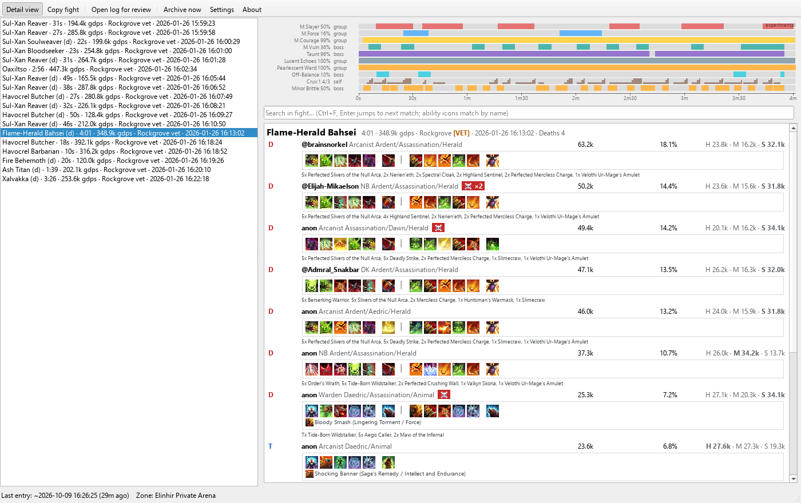
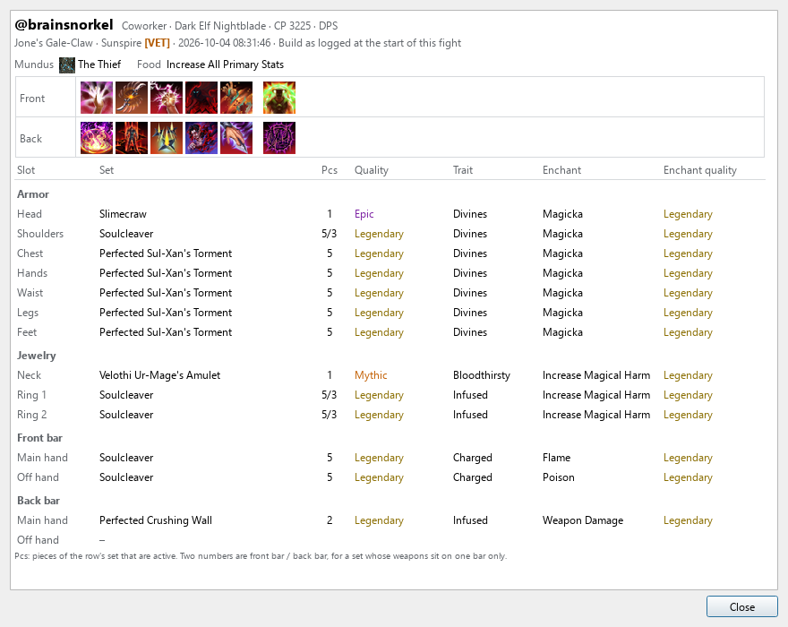
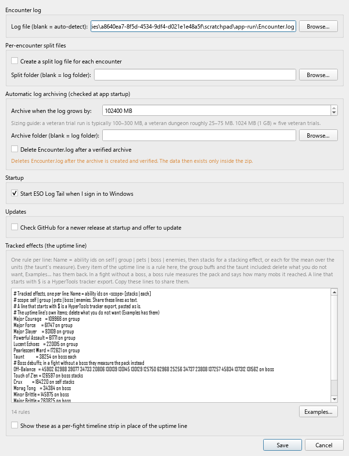

# ESO Log Tail

Live fight summaries from Elder Scrolls Online encounter logs, in a desktop app for Windows, with an experimental Linux build. ESO Log Tail watches your `Encounter.log` and, the moment combat ends, shows who was in the group, how each player was built, and how they performed.



## Features

- **Fight summaries as combat ends**: boss or mob name, duration, group DPS, zone, time, and deaths, with every fight of the session kept in a history list.
- **Players ranked by damage**, with role (Tank/Healer/DPS), class, DPS, damage share, and resource pools (the largest in bold).
- **Death recaps**: a player who died gets a **Death recap** button on their row. It opens the last 5 seconds before each of their deaths: every hit and heal with its source, the health left after it, and whether the hit was blocked, dodged, or absorbed by a shield.
- **Builds at a glance**: both ability bars as the game's own icons, subclass lines when a build borrows from another class, and every equipped gear set with piece counts. Gear set identification uses the LibSets database (722 sets).
- **Scribed skills with their scripts**: a grimoire's icon cannot show what was scribed into it, so each scribed skill is listed under the bars with its signature and affix scripts, for example `Chilling Contingency (Lingering Torment / Intellect and Endurance)`.
- **Full build per player**: click a player's name for a window with their gear slot by slot (set, quality, trait, enchant, slotted poison), both ability bars, mundus stone and food.
- **ESO-Hub links**: hover an ability icon for its name, click it to open the skill on ESO-Hub; set names open their ESO-Hub set pages. Nothing is downloaded until you click.
- **Group buff uptimes** (Major Courage, Major Force, Major Slayer, Powerful Assault, Lucent Echoes, Pearlescent Ward), or an experimental per-fight buff timeline strip.
- **Search within a fight** (Ctrl+F), including ability icons by name; copy any fight as plain text.
- **Review any log file** without interrupting live monitoring.
- **Log housekeeping**: per-encounter split files, automatic archiving of oversized logs (they grow into the tens of GB), and a freshness indicator so you can tell at a glance that logging is on.
- **Zero-friction startup**: auto-detects the log (including OneDrive-relocated Documents folders), replays the current session so the group is complete when you start mid-raid, can start with Windows, and offers updates from GitHub.

> **Upgrading from 0.2.x or earlier?** Versions up to 0.2.7 were terminal applications with command-line flags. Those are gone; see [Migrating from the terminal version](#migrating-from-the-terminal-version).

## Installation

### Option 1: Installer (recommended)

1. Download `esolog-tail-windows-setup-<version>.exe` from the [latest release](https://github.com/brainsnorkel/eso-live-encounterlog-sets-abilities/releases).
2. Run it. No administrator rights are needed (per-user install). If Windows SmartScreen shows "unknown publisher", choose **More info → Run anyway**; the installer is not code-signed.
3. Launch **ESO Log Tail** from the Start Menu. Installing a newer version later upgrades in place and keeps your settings.

### Option 2: Portable zip

Download `esolog-tail-windows-portable-<version>.zip`, extract it anywhere, and run `esolog-gui.exe`.

### Option 3: Linux tarball (experimental)

The Linux build is new. It is built and start-tested automatically, but it has not been run against a live game, so treat it as a test build and please report what you find.

1. Download `esolog-tail-linux-x86_64-<version>.tar.gz` from the [latest release](https://github.com/brainsnorkel/eso-live-encounterlog-sets-abilities/releases).
2. Extract it and run the app:

   ```bash
   tar -xzf esolog-tail-linux-x86_64-<version>.tar.gz
   ./esolog-tail-<version>/esolog-gui
   ```

It needs a 64-bit x86 desktop (X11 or Wayland) with glibc 2.35 or newer: Ubuntu 22.04, Debian 12, Fedora 36, or later. Nothing is installed; delete the folder to remove it. What differs from Windows:

- **Finding the log**: the app looks in ESO's Steam (Proton) prefix, including Flatpak Steam, and in the default `~/.wine` prefix. For Lutris, Bottles, a Steam library on another drive, or any other prefix, set the path under Settings → Encounter log. See [ESO log file locations](#eso-log-file-locations).
- **Updates**: there is no installer, so the update prompt opens the release page for you to download the new tarball.
- **Start at login** is not offered.
- Settings and `crash.log` live in `~/.config/esolog-tail/`.

### Option 4: From source

```bash
git clone https://github.com/brainsnorkel/eso-live-encounterlog-sets-abilities.git
cd eso-live-encounterlog-sets-abilities
pip install -r requirements.txt
python src/esolog_gui.py
```

## Turn on encounter logging in ESO

ESO only writes `Encounter.log` while encounter logging is on, and it is off by default. There is nothing for the app to show until it is enabled.

- **Recommended: the Easy Stalking addon.** Install [Easy Stalking - Encounterlog](https://www.esoui.com/downloads/info2332-EasyStalking-Encounterlog.html) from ESOUI (or through Minion). It turns logging on and off for you by content type (trials, dungeons, arenas, PvP), shows an on-screen indicator while logging, and adds the `/ezlog` chat command. With it installed you never have to remember to start the log.
- **Manual**: type `/encounterlog` in the chat box to toggle logging, or enable it under Settings → Combat → Combat Logging. You have to remember to do this before each run.

The status bar's **Last entry** indicator turns green while the log is being written, so you can confirm logging is on from the app.

## Using the app

Launch ESO Log Tail before or during play; both work. It picks the most recently updated `Encounter.log` across the known ESO locations. If there is no log yet, it waits and attaches automatically when the file appears. If a logging session is already under way, the app replays it on attach: the session's fights load into the history and the full roster, gear, and abilities are known, so starting mid-raid does not leave you with a half-empty group (sessions over 768 MB fall back to a faster roster-only sweep).

### Fight history

Each completed fight appears in the list on the left as `boss · duration · gdps · zone · timestamp` (`vet` marks veteran difficulty, and `(d)` after the name marks a fight in which a player died). The newest fight is selected automatically; selecting an older fight pauses that, and selecting the newest again resumes it.

### Fight detail

The right pane shows the selected fight.

- **Header**: boss or mob name, then duration, group DPS, zone, start time, and player deaths.
- **One row per player**, sorted by damage share: role letter (**T**ank, **H**ealer, **D**PS, inferred from resource pools, a restoration staff or healing output for healers, and taunt or heal abilities), name, class, DPS, damage share, and max Health, Magicka, and Stamina with the largest pool in bold. The player who dealt the fight's first damage is marked with `*`. When a build borrows a skill line from another class, the lines show beside the class, for example `NB Assassination/Aedric/Grave`; a stock build shows just the class.
- **Build card** (toggle with **Detail view** on the toolbar, or Tab): both ability bars as the game's icons, bar 1 on the left and bar 2 on the right, ultimate set apart. Hover an icon for the ability name; click it to open that skill's page on [ESO-Hub](https://eso-hub.com). Abilities without a bundled icon show their name instead.
- **Scribed skills**: under the bars, each scribed skill with the two scripts its name does not reveal, as `Skill (Signature / Affix)`: `Shocking Banner (Class Flourish / Heroism)`. The skill's name already says which grimoire and focus script it is; hover its icon on the bar for all four parts. The skill and the scripts link to their ESO-Hub pages. `(scripts not in log)` means the log does not say which scripts this player uses (see [Limitations](#limitations)); the hover says why, and lists the combinations it can be when the log narrows it down.
- **Gear**: every equipped set with its piece count, for example `5x Deadly Strike, 2x Zaan, 1x Oakensoul Ring`. Set names are links to their ESO-Hub pages; hover to see the target.
- **Group buffs**: for groups of three or more, a line of uptime percentages for Major Courage, Major Force, Major Slayer, Powerful Assault, Lucent Echoes, and Pearlescent Ward. When the experimental timeline strip is on, the strip replaces this line.

### Death recap

A red **☠ Death recap** button appears beside each player who died in the fight (`×2` when they died twice). Hover it for when, and to what, they died. Click it to open the recap window, which stays open beside the fight view.

For each of that player's deaths the window names the killing ability and who used it, then lists the last 5 seconds of damage and healing, oldest first:

- **Time** before the death, and the player's **health** after the event (with its share of max health).
- The **ability**, with the game's icon, and its **source**: the monster or player that hit or healed.
- The **amount** that reached or restored health, and the **result**: hit, critical hit, DoT, blocked, dodged, missed, fall damage, heal, or HoT. A hit soaked by a damage shield says how much was absorbed and by which shield, a heal eaten by a healing-absorb effect is listed as such, and the killing blow shows its overkill.

Heals that were pure overheal are left out. A death whose event the game writes just after combat ends (the last player standing in a wipe) is still counted and added to that fight.

### Build window

Click a player's name in the fight pane, in either view, to open their build for that fight. The name is underlined while the pointer is over it. The window stays open beside the fight view and keeps the fight it was opened for; clicking another name reuses it.



- **Header**: account and character name, race, class, champion points and role, then the fight.
- **Mundus and food**: the mundus stone, and the food or drink buff the player had as combat started. `no known food or drink` means none of their effects is a food or drink the app knows.
- **Bars**: front bar above back bar, ultimate set apart, with the fight view's hover text, ESO-Hub links and line of scribed skills.
- **Gear**: one row per slot under Armor, Jewelry, Front bar and Back bar, with the set (a link to its ESO-Hub page), quality, trait, enchant and the enchant's quality. A slot with nothing logged shows a dash, a mythic piece is marked Mythic, and a slotted poison gets a row under its bar.
- **Weight** says whether an armor piece is light, medium or heavy, and the Armor heading counts the pieces of each, for example `5 medium, 1 light, 1 heavy`. A dash means the app does not know the piece (see [Limitations](#limitations)).
- **Pcs** is the number of pieces of the row's set that are active, counted per weapon bar: armor and jewelry count on both bars, and each bar adds its own weapons, a two-handed one as two. `5` means five on either bar. `5/3`, as on Soulcleaver in the picture, means five on the front bar and three on the back: that set's five-piece bonus is live on the front bar only.

### Search, copy, review

- **Search in fight** (Ctrl+F): type in the field above the fight pane to highlight every occurrence, with a live match count; Enter jumps between matches, Esc clears. Ability icons match by the name they stand for, so `jabs` lights up every Biting Jabs icon. The search follows you as you switch fights.
- **Copy fight** (Ctrl+C): copies the selected fight as plain text, names rather than icons, ready to paste into Discord. Scribed skills keep their scripts: `Leashing Soul (Druid's Resurgence / Cowardice)`.
- **Open log for review**: load any log file, a split file or an unzipped archive, and browse its fights while live monitoring continues in the background. **Back to live** returns to the live session.
- **About**: version, project link, and credits.

### Status bar

- **Last entry**: the time of the newest log line and how long ago it was: green while **live** (under 2 minutes), plain while idle, amber when **stale** (over 30 minutes), and red **No log file** when nothing is being monitored. A `~` prefix means the time came from the file clock rather than log content.
- **Zone**: the current zone and difficulty.
- A progress bar on the right while the app parses a reviewed log, catches up on a large backlog, archives, or downloads an update.

## Settings

Open **Settings…** from the toolbar.



- **Encounter log**: a specific `Encounter.log`, or blank to auto-detect.
- **Per-encounter split files**: write each encounter to its own `YYMMDDHHMMSS-{Zone-Name}{-vet}.log` in a folder of your choice (blank uses the log's folder).
- **Automatic log archiving**: the growth threshold that triggers an archive at startup, the archive folder, and whether to delete the original after a verified archive. See [Automatic log archiving](#automatic-log-archiving).
- **Startup**: *Start ESO Log Tail when I sign in to Windows*, a per-user login entry that needs no admin rights and is removed on uninstall.
- **Updates**: check GitHub for a newer release at startup and offer to update.
- **Experimental**: the buff timeline strip, see below.

Settings live in a per-user file, `%LOCALAPPDATA%\esolog-tail\config.json` (`~/.config/esolog-tail/config.json` on Linux), and survive upgrades and uninstalls.

### Automatic updates

At startup the app checks GitHub for a newer release (Settings → Updates to disable). When one exists you are prompted with **Update now / Later / Skip this version**. Updating downloads the installer with a progress bar, closes the app, and hands over to the installer; settings are kept and the app relaunches when it finishes. Nothing is ever installed without the prompt. On Linux the first button is **Open download page**: it opens the release page, where you download the new tarball.

### Experimental: buff timeline

Settings → Experimental → *Buff timeline* (off by default) adds a compact strip above each fight: one thin line per tracked effect (Major Slayer, Major Force, Major Courage, Major Berserk, Powerful Assault, Major Vulnerability), filled where the effect was active, with the uptime percentage in the row label and time ticks underneath. A group buff that only reached one or two people renders dotted rather than solid. Hover a segment to see who cast it and who received it. Rows for effects that never occurred are omitted, and the strip disappears when there is nothing to show. When the strip is shown it replaces the text uptime line. Being experimental, it may change or be removed.

## Automatic log archiving

ESO never truncates `Encounter.log`. With regular raiding it grows by hundreds of MB a night and can reach tens of GB. ESO Log Tail archives it for you.

- **When**: checked **once, at app startup**. ESO keeps the log file open for the whole game session (even between `/encounterlog` toggles), so start-up, typically before you launch ESO, is the safe moment.
- **Trigger**: the log has grown by more than the configured threshold since the last archive. Default **1024 MB**, about five veteran trials (a vet trial run is typically 100 to 300 MB; a vet dungeon roughly 25 to 75 MB).
- **What it does**: streams the log into `Encounter-YYMMDDHHMMSS.zip` (stamped from the newest log entry) in the archive folder, default next to the log, showing progress in the status bar. The archive is written as a `.partial` file and only renamed to `.zip` after it verifies, so an interrupted archive never leaves a corrupt zip behind.
- **Safety**: the app takes exclusive access to the log for the whole operation. If ESO is running and holds the file, the archive is **skipped with a notification** and monitoring starts normally; nothing is ever zipped mid-write. Linux cannot lock a file that way, so there the app skips the archive when another process has the log open, and keeps the original if the log grew while it was being zipped.
- **Your original log is kept** by default. If you enable *Delete Encounter.log after a verified archive*, the original is removed only after the zip verifies, and ESO starts a fresh, small log.
- **Archive now** (toolbar) runs the same guarded archive at any moment, handy right after you close ESO.

## What the analysis is based on

- **Fights**: a fight runs from the game's `BEGIN_COMBAT` line to its `END_COMBAT` line. The game also writes that pair in the middle of a fight, a fraction of a second apart, most often as you are resurrected. When combat starts again within a second of ending and an enemy the group was hitting is still alive, the app carries on with the same fight. Its first part shows as a fight until the fight really ends, and that entry is then brought up to date.
- **Builds**: `PLAYER_INFO` events carry each player's slotted abilities and gear. Skill lines are matched by exact ability name against the class skill tables; a build shows at most three lines.
- **Gear sets**: item set ids are mapped through the [LibSets](https://github.com/Baertram/LibSets/tree/LibSets-reworked/LibSets) database.
- **Gear detail, mundus and food**: the same `PLAYER_INFO` line lists each equipped item with its trait, quality and enchant, and the player's long-term effects, among them the mundus boon and the food buff. A slotted poison is logged as an item id, named through UESP's item database; food is recognised by the buff list of the LibFoodDrinkBuff addon. The log does not say how heavy an armor piece is, so its item id is looked up in a table of every light, medium and heavy piece, also from UESP's item database.
- **Ability icons**: the log names each ability's icon file, and the app ships those icons extracted from the game (see [Refreshing game data](#refreshing-game-data-after-an-eso-patch)).
- **Scribed skills**: the log names a scribed skill's focus, signature and affix scripts on its `ABILITY_INFO` line, directly before the `PLAYER_INFO` of the player who uses it. That is how scripts are tied to players: the ability id alone covers several focus scripts of a grimoire, so two players with the same id can run different skills. The grimoire is read from the skill's icon.
- **ESO-Hub links**: bundled maps from ESO-Hub's sitemaps; an ability name is matched to its skill page slug, a set name to its set page, a scribed skill and its scripts to their scribing pages.
- **Roles**: the largest resource pool decides. Health is a tank and stamina a DPS. A player whose largest pool is magicka is a healer when a restoration staff is equipped on either bar, or when they healed other players for more than the damage they dealt in that fight; otherwise a DPS. The log does not name weapon types, so the staff is recognised by its item id, from UESP's item database. When all three pools are within 10% of each other, taunt and heal abilities on the bars decide instead.
- **Deaths**: player `DIED` events during the fight, and `KILLING_BLOW` events on a player, which is how the log records a player killed by another player (a shared mechanic, PvP). The recap comes from the `COMBAT_EVENT` lines that hit or healed that player in the 5 seconds before.

### Limitations

- Players stay anonymous ("unknown" builds) until the log has produced `ABILITY_INFO` and `PLAYER_INFO` events for them.
- Sets the bundled LibSets data does not know appear as `Set#<id>` and have no link.
- A scribed skill's scripts are not always in the log, and the skill then shows `(scripts not in log)`. Two cases: the game sometimes writes a player's skill without scripts (they usually follow by a later fight, which then shows them); and it writes each script combination once per logging session, for the first player seen with it, so a later player whose combination was already written gets no line of their own. When that leaves more than one possibility, the skill shows under the grimoire's name. For the same reason, a player who re-scribes mid-session to a combination already written keeps showing their earlier scripts.
- After an ESO patch, new skills show as text until the icon set is refreshed, and the ESO-Hub link maps use English page names, so logs from a non-English client will not link.
- Death recaps show what the log records: damage that reached health, blocks, dodges, and shield absorption. What armor and resistances mitigated is not in the log, and neither are health costs the player paid themselves, which appear only as a drop in the health column.
- Gear is logged per equipped slot: an empty slot (the off hand beside a two-handed weapon, say) has no entry. Item names, weapon types and armor weights are not in the log at all. Armor weight is shown all the same, looked up by item id in a bundled table; a piece from a set newer than that table shows a dash in the Weight column until the table is refreshed.
- Roles are a heuristic. A healer whose largest pool is health or stamina shows as a tank or a DPS, and a restoration staff from a set newer than the bundled list is not recognised until the list is refreshed (out-healing their own damage still marks them a healer).
- The build window shows the build as combat started. The game writes it once per fight, so gear or skills swapped during the fight do not show.
- A crafted poison is named by its primary effect (`Damage Health Poison IX`); its other effects are not in the log. A food added to the game after the bundled list was built reads as `no known food or drink` until the list is refreshed.

## Migrating from the terminal version

Versions up to 0.2.7 were terminal applications launched from `.BAT` files with CLI flags. Their behaviour moved into the GUI:

| Old CLI flag | Where it went |
|---|---|
| `-f, --log-file PATH` | Settings → Encounter log |
| `--tail-and-split` / `--split-dir` | Settings → Per-encounter split files |
| `--save-reports` / `--reports-dir` | Removed; fight summaries live in the app (use Copy fight) |
| `--read-all-then-tail` | Automatic: the app replays the current session on attach; use *Open log for review* for older fights |
| `--read-all-then-stop` (replay) | *Open log for review* |
| `--no-wait` | Removed: the app always waits and shows a waiting state |
| `--replay-speed` | Not needed: review mode loads at full speed |
| `--no-tui`, `--diagnostic`, `--list-hostiles` | Removed with the terminal output (diagnostics surface in the status bar) |
| `-v, --version` | Window title, About, or Apps & Features |

Delete your old `.BAT` files and `esolog-tail.exe`; the app is `esolog-gui.exe`.

## ESO log file locations

Auto-detection searches, and picks the most recently updated of:

- `%USERPROFILE%\Documents\Elder Scrolls Online\live\Logs\Encounter.log`
- `%USERPROFILE%\Documents\Elder Scrolls Online\Logs\Encounter.log`
- `%USERPROFILE%\OneDrive\Documents\Elder Scrolls Online\live\Logs\Encounter.log`

On Linux it uses the first of these that exists (each ends in `Documents/Elder Scrolls Online/live/Logs/Encounter.log`):

- `~/.wine/drive_c/users/Public/` and `~/.wine/drive_c/users/<you>/`
- `~/.steam/steam/steamapps/compatdata/306130/pfx/drive_c/users/steamuser/`
- the same Steam path under `~/.local/share/Steam/` and, for Flatpak Steam, under `~/.var/app/com.valvesoftware.Steam/.local/share/Steam/`

## Building from source

The [development guide](docs/development.md) describes the repository layout, the tests and the release process; the short version follows.

Prerequisites: Python 3.9+ (3.11 recommended) on Windows.

```cmd
pip install -r requirements.txt
pip install -r requirements-build.txt

:: Tests
python -m pytest tests/ -q

:: GUI executable (onedir, windowed) -> dist/esolog-gui/
python -m PyInstaller esolog-tail.spec --noconfirm

:: Installer (requires Inno Setup 6) -> dist/esolog-tail-windows-setup-<version>.exe
iscc /DAppVersion=0.6.4 installer\esolog-gui.iss
```

Tagged releases (`v*`) build the installer, the portable zip, and the Linux tarball automatically via GitHub Actions.

On Linux the same tests and PyInstaller command apply, and `dist/esolog-gui/` is the folder the release job packs into the tarball. Build on the oldest distribution you want to support, with Qt's X11 libraries installed (the package list is in `.github/workflows/build-installers.yml`): PyInstaller bundles the ones it finds, and a build without them will not start on a desktop that lacks `libxcb-cursor0`.

### Refreshing game data after an ESO patch

The app bundles seven data sets that go stale when the game changes:

```cmd
:: Ability and death-recap icons from your installed game (needs UESP's
:: EsoExtractData and Pillow; see the script's header for the paths it looks
:: for). About 2.5 minutes.
python scripts\extract_ability_icons.py --check-log "%USERPROFILE%\Documents\Elder Scrolls Online\live\Logs\Encounter.log"

:: ESO-Hub skill, set and scribing link maps, from ESO-Hub's sitemaps (network access)
python scripts\generate_esohub_links.py

:: Gear set data, after dropping a new LibSets_SetData.xlsm into data/gear_sets/
python scripts\generate_gear_data.py

:: Poison names for the build window, from UESP's item database (network access)
python scripts\generate_poison_names.py

:: Food and drink buff ids for the build window, from the LibFoodDrinkBuff addon
:: (your installed copy, else its ESOUI download)
python scripts\generate_food_buffs.py

:: Restoration staff item ids for the healer role, from UESP's item database
:: (network access)
python scripts\generate_restoration_staves.py

:: Armor weights (light, medium, heavy) for the build window, from UESP's item
:: database (network access)
python scripts\generate_armor_weights.py
```

After a patch, `python scripts\generate_food_buffs.py --check-log <path to Encounter.log>` lists food-style effects in a recent log that the bundled table does not know yet, so a new food is noticed before it reads as "no food" in the build window.

The icon step is also packaged as the `refresh-ability-icons` skill for Claude Code users of this repository. The icon script reports which icons were added or removed and, with `--check-log`, verifies that every ability slotted in that log has an icon.

## Troubleshooting

**SmartScreen warning on the installer**: the installer is not code-signed; choose *More info → Run anyway*.

**No fights appear**: make sure encounter logging is on in-game (the status bar's *Last entry* indicator turns green during combat). Fights appear once combat ends, since the analysis needs complete `BEGIN_COMBAT` / `END_COMBAT` events.

**"Waiting for Encounter.log"**: logging has never been enabled, or your log lives somewhere unusual: point Settings → Encounter log at it directly.

**Archive was skipped**: ESO was running and had the log open. Close ESO and use *Archive now*, or let the next app start handle it.

**The app closed unexpectedly**: unhandled errors in the windowed build are written to `%LOCALAPPDATA%\esolog-tail\crash.log` (`~/.config/esolog-tail/crash.log` on Linux); please attach it to a bug report.

**Linux: the app does not start**: run `./esolog-gui` from a terminal to see Qt's message, and include it in a bug report along with your distribution and whether the desktop is X11 or Wayland.

## Requirements

- Windows 10/11, or 64-bit Linux with glibc 2.35 or newer (experimental build)
- Runtime: `PySide6`, `platformdirs` (see `requirements.txt`)
- ESO encounter logging enabled in-game

## License

Released under the [MIT License](LICENSE). ESO game data belongs to ZeniMax Online Studios.

## Credits

The same credits are shown in the app under **About…**.

- **[ESO-Hub.com](https://eso-hub.com)**: the skill and gear set links in the detail view open pages on ESO-Hub, and the hover (popup) text names those targets. Thanks to the ESO-Hub team for supporting community tools that link to their site. The app sends nothing to ESO-Hub until you click a link; the hover text is built from the app's own data and the link target.
- **Game icons**: the ability icons shown on the bars and in death recaps are extracted from your own ESO installation (see `scripts/extract_ability_icons.py`) and bundled for display only. They are © ZeniMax Online Studios and are not the property of this application. The Elder Scrolls Online and its artwork are © ZeniMax Online Studios; ESO Log Tail is an unofficial fan tool, not affiliated with or endorsed by ZeniMax.
- **[LibSets](https://github.com/Baertram/LibSets/tree/LibSets-reworked/LibSets)** by Baertram: the gear set database behind set identification.
- **[LibFoodDrinkBuff](https://www.esoui.com/downloads/info1902-LibFoodDrinkBuff.html)** by Scootworks and Baertram: the list of food and drink buffs behind the build window's food line.
- **[EsoExtractData](https://en.uesp.net/wiki/ESO_Mod:EsoExtractData)** by UESP: the tool that extracts the icons from the game files.
- **[Easy Stalking - Encounterlog](https://www.esoui.com/downloads/info2332-EasyStalking-Encounterlog.html)**: the addon that makes turning logging on a non-event.
- **[ESO Log Tool](https://github.com/sheumais/logs)** by sheumais: insights into ESO log format parsing, and the idea of showing a scribed skill with its scripts as `Name (Signature / Affix)`.
- **[UESP](https://en.uesp.net/wiki/Online:Online)**: authoritative skill line and ability information, and the item database behind the build window's poison names and armor weights and the list of restoration staves that marks healers.
- **ESO community**: encounter log format documentation and testing feedback.
