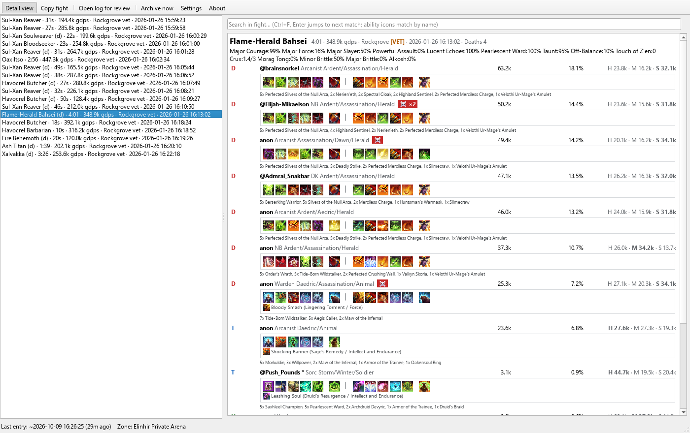
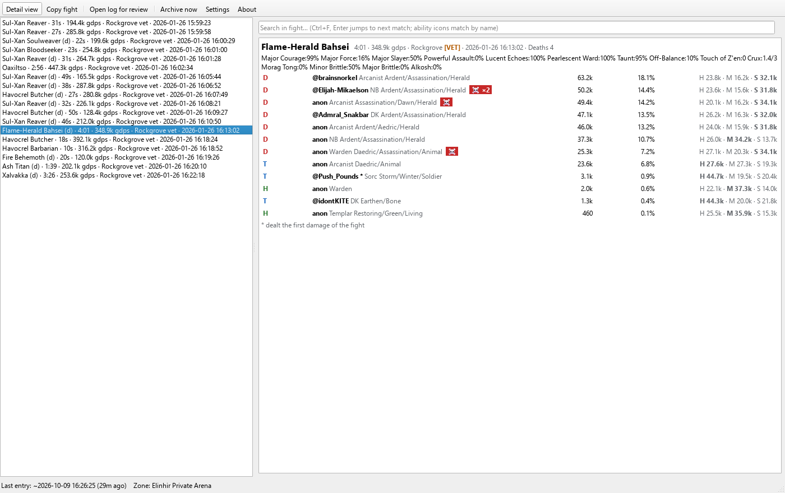
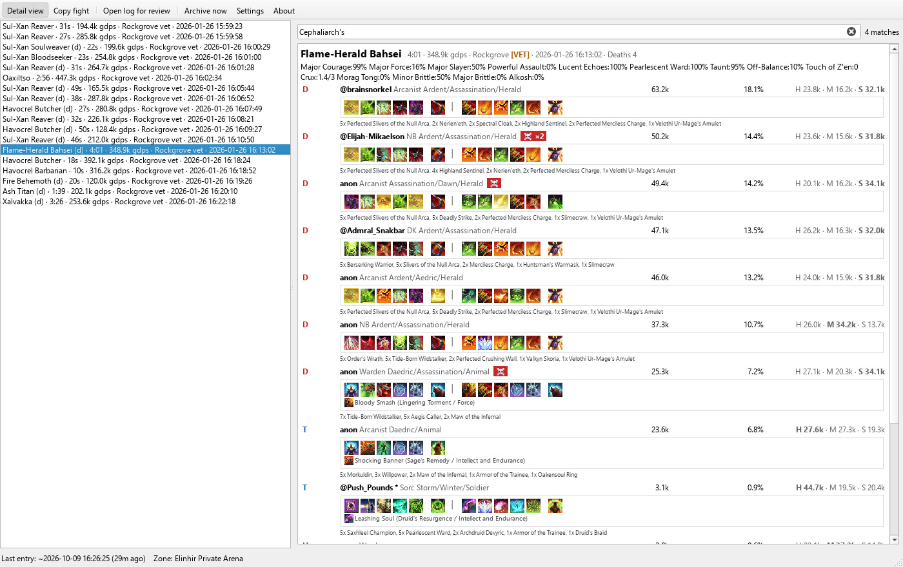
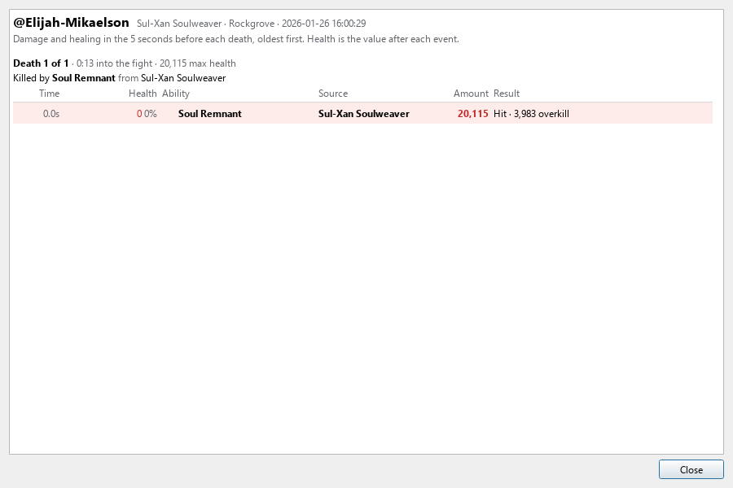
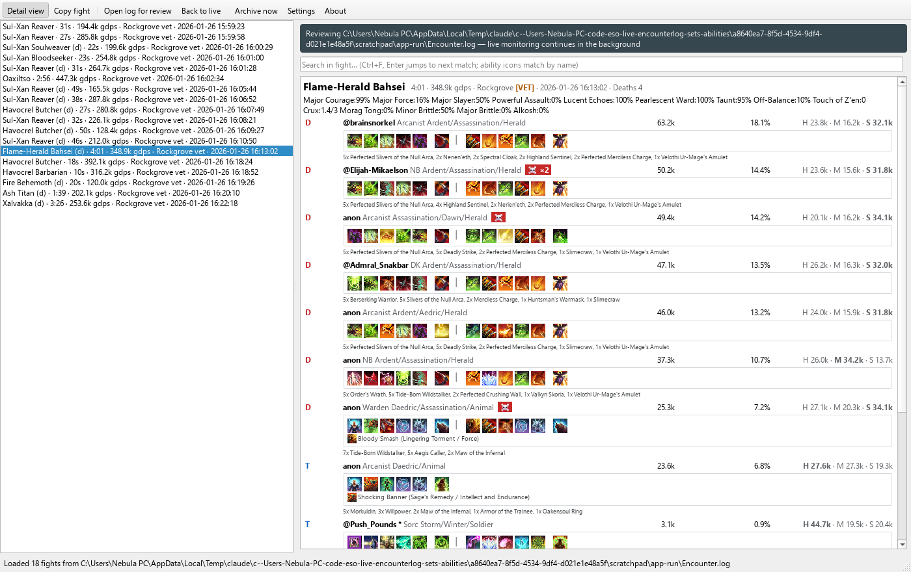

# ESO Log Tail user guide

A walk through the app, screen by screen. The pictures are taken from the app itself over a veteran Sunspire log (`scripts/capture_screenshots.py` regenerates them), so they show what you will see. The [README](../README.md) has the installation steps and the full reference of every setting; this guide is about using the app during and after a raid.

## First run

1. Install or unzip the app and start it. It looks for `Encounter.log` in the usual ESO folders, including a Documents folder that OneDrive has moved, and picks the most recently written one. If there is no log yet, it waits and attaches the moment the file appears.
2. In ESO, turn logging on with `/encounterlog` (or let an addon such as Easy Stalking do it when you enter a trial or dungeon). The status bar's **Last entry** turns green as soon as new lines arrive.
3. Start the app before or during play; both work. Joining mid-raid, it replays the session already in the log, so the group, their gear and their bars are complete and the fights so far are in the history.

## The main window



- **Left**: the history, one line per completed fight: `boss · duration · group DPS · zone · time`. `vet` marks veteran difficulty and `(d)` a fight in which a player died. The newest fight is selected as it ends; select an older fight to read it, and the newest again to follow live fights.
- **Right**: the selected fight. The header names the boss, the duration, the group DPS, the zone, the start time and the deaths. Under it, for a group of three or more, the uptime line: how much of the fight Major Courage, Major Force, Major Slayer, Powerful Assault, Lucent Echoes and Pearlescent Ward were on anyone in the group, and `Taunt:NN%`, how long the boss had a taunt on it.
- **One row per player**, ranked by damage: the role letter (**T**ank, **H**ealer, **D**PS), the account name, the class, and when a build borrows skill lines from another class, those lines beside it; then DPS, the share of the group's damage, and the player's health, magicka and stamina with the largest pool in bold. A `*` after a name marks the player who dealt the fight's first damage.

The DPS numbers include what a player's pets did: a Necromancer's Blastbones and Skeletal Archer, a Warden's bear, a Sorcerer's atronachs and familiar, a companion. The ticks of damage-over-time effects are not counted.

### A player's row in detail

With **Detail view** on (the default, Tab toggles it), each row shows the player's two ability bars as the game's icons, front bar left and back bar right, the ultimate set apart.

- Hover an icon for the ability's name; click it to open the skill on ESO-Hub.
- An ability the player taunted with in this fight is ringed in purple.
- A scribed skill is listed under the bars with the two scripts its name does not show, as `Shocking Banner (Class Flourish / Heroism)`.
- The line under the bars lists every equipped set with its piece count, `5x Deadly Strike, 2x Zaan, 1x Oakensoul Ring`; each name opens the set's ESO-Hub page.

With Detail view off, the rows are one line each, for a quick ranking:



### Finding things in a fight

Type in the search field above the fight (Ctrl+F puts the cursor there). Every match is highlighted and counted, Enter jumps to the next one, Esc clears. Icons match by the ability they stand for, so searching `jabs` lights up every Biting Jabs icon:



## A player's build

Click a player's name to open their build for that fight. The window stays open beside the main window and keeps the fight it was opened for; clicking another name reuses it.


- **Header**: account and character name, race, class, champion points and role, then the fight.
- **Mundus and food**: the mundus stone, and the food or drink buff the player had as combat started.
- **Bars**: as in the fight view, with the same hover names, ESO-Hub links and scribed-skill line.
- **Gear**: one row per slot under Armor, Jewelry, Front bar and Back bar. **Type** is the armor weight, or what a weapon is (Inferno Staff, Dagger, Greatsword, Shield). **Pcs** is how many pieces of that row's set are active: `5` on either bar; `5/3` means five on the front bar and three on the back, so the set's five-piece bonus is live on the front bar only. Quality, trait, enchant and the enchant's quality follow. A mythic piece is marked, a slotted poison gets a row under its bar, and a dash means the log did not say.

## Death recaps

A player who died has a red **☠ Death recap** button on their row (`×2` for two deaths). Hover it for when and to what they died; click it for the recap window.



For each death it names the killing ability and who used it, then lists the last five seconds of damage and healing, oldest first: the time before the death, the health left after each event, the ability with its icon and its source, the amount, and whether the hit was a critical, a DoT tick, blocked, dodged, absorbed by a shield (and which), or a heal. The killing blow shows its overkill.

## Tracking effects of your own

The uptime line's group buffs and taunt are built in. To watch anything else, open Settings → **Tracked effects** and write one rule per line:

```
Off-Balance   = 45902 62988 39077 34733 20806 130139 on boss
Touch of Z'en = 126597 on boss stacks
Crux          = 184220 on self stacks
```

Each rule adds an item to the uptime line of every fight: `Off-Balance:17%` is how much of the fight the boss was off balance under any of those ids, and `Crux:2.1/3` the mean and peak Crux you held. The scope after `on` says whose effects count (`self`, `group`, `pets`, `boss` or `enemies`), and `stacks` asks for the count instead of the uptime. The box tells you how many rules it holds and which lines it cannot read; **Examples** brings the bundled ones back.

The rules are plain text: copy them to a friend, or paste theirs in. A tracker exported from the HyperTools addon works too: paste its `$...` string as a line and its name, ability ids and target become a rule. Save restarts monitoring, so the rules apply to the session's fights at once.

## The buff timeline (experimental)

Settings → Experimental → **Buff timeline** adds a strip above the fight: one thin row per tracked effect (Major Slayer, Major Force, Major Courage, Major Berserk, Powerful Assault, Major Vulnerability, Taunt), filled where the effect was up, with the uptime in the row label and time ticks underneath. A group buff that reached only one or two people is dotted rather than solid. Hover a segment for who cast it and who received it. Beside each row's label a word says whose effect it is: `group` for the group buffs, `boss` for Major Vulnerability and the taunt, and the scope of each tracked rule (`self`, `pets`, `enemies`). The strip replaces the text uptime line.


## Reviewing a log

**Open log for review** loads any log file, a split file or an unzipped archive, and lists its fights while live monitoring carries on underneath. A banner shows which file is open; **Back to live** returns to the live session.



## Copying a fight

**Copy fight** (Ctrl+C) puts the selected fight on the clipboard as plain text, names rather than icons, ready for Discord: the header, the uptime line, each player with their bars, sets and scribed skills, and for anyone who taunted, what with: `taunted with Inner Rage ×262`.

## Settings


- **Encounter log**: a specific file, or blank to auto-detect.
- **Per-encounter split files**: one `YYMMDDHHMMSS-Zone-Name-vet.log` per encounter, in a folder of your choice. These are handy for review, and small enough to share.
- **Automatic log archiving**: ESO never truncates `Encounter.log`, so it grows by hundreds of MB a night. Once it has grown past the threshold, the app zips it at startup (before ESO has the file open), and can delete the original after the zip has verified, so ESO starts a fresh, small log. **Archive now** on the toolbar does the same at any moment, for instance right after you close ESO.
- **Startup**: start the app when you sign in to Windows.
- **Updates**: check GitHub for a newer release at startup and offer to install it; nothing is installed without the prompt.
- **Experimental**: the buff timeline strip.

Saving restarts monitoring: the history clears and the current session is replayed with the new settings.

## The status bar

- **Last entry**: the time of the newest log line and how long ago: green while live (under two minutes), plain while idle, amber when stale (over thirty minutes), red **No log file** when nothing is monitored. A `~` means the time came from the file's clock rather than its content.
- **Zone**: the current zone and difficulty.
- A progress bar on the right while the app parses a reviewed log, catches up on a backlog, archives, or downloads an update.

## When something looks wrong

- **A set shows as `Set#123`**: the set is newer than the bundled set table; it will be named after the next release.
- **An ability shows as text instead of an icon**: the icon is not in the bundled set; the name still links to ESO-Hub.
- **A weapon's Type is a dash**: the weapon is from a set newer than the bundled weapon table.
- **The app crashed**: `crash.log` next to the settings file (`%LOCALAPPDATA%\esolog-tail\` on Windows, `~/.config/esolog-tail/` on Linux) has the details; please attach it to a GitHub issue.
- **How the numbers are made**: the [design notes](design.md) explain what the log carries and how buffs, taunts, pets, roles, skill lines, icons and set names are worked out.
